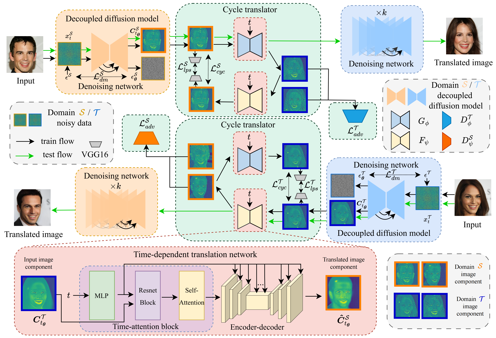

# 🌟 CycleDiff: CycleDiff: Cycle Diffusion Models for Unpaired Image-to-image Translation [[](https://zoushilong1024.github.io/CycleDiff/)	[](https://arxiv.org/abs/2508.06625)]

<br> 
<div align=center>
    
</div>
<br>

## 🧭 Content
- [🌟 CycleDiff: CycleDiff: Cycle Diffusion Models for Unpaired Image-to-image Translation \[	\]](#-cyclediff-cyclediff-cycle-diffusion-models-for-unpaired-image-to-image-translation-)
  - [🧭 Content](#-content)
  - [🛠 Installation](#-installation)
  - [🚀 Train CycleDiff from scratch](#-train-cyclediff-from-scratch)
    - [0. prepare dataset and the pretrained weight](#0-prepare-dataset-and-the-pretrained-weight)
    - [1. train VAE](#1-train-vae)
    - [2. train ldm](#2-train-ldm)
    - [3. train cycle translator (supports Multi-GPU training)](#3-train-cycle-translator-supports-multi-gpu-training)
  - [🔍 Test CycleDiff](#-test-cyclediff)
  - [🙏 Acknowledgement](#-acknowledgement)
  - [📬 Contact](#-contact)
  - [📖 Citation](#-citation)


## 🛠 Installation
```bash
conda create -n cyclediff python=3.9 && conda activate CycleDiff
git clone https://github.com/ZouShilong1024/CycleDiff.git && cd CycleDiff
pip install torch==1.13.1+cu117 torchvision==0.14.1+cu117 torchaudio==0.13.1 --extra-index-url https://download.pytorch.org/whl/cu117
pip install -r requirement.txt
```

<!-- ## 🔥 News -->
<!-- - 06-30-2025: Release pre-trained cat-to-dog image translation model. See USAGE.md for usage examples. -->

## 🚀 Train CycleDiff from scratch
### 0. prepare dataset and the pretrained weight
The structure of the dataset should be as follows:
```
datasetA2B
|-- train
|   |-- class_A
|   |   |-- 0.png
|   |   |-- 1.png
|   |   |-- ...
|   |-- class_B
|   |   |-- 0.png
|   |   |-- 1.png
|   |   |-- ...
|-- test
|   |-- class_A
|   |   |-- 0.png
|   |   |-- 1.png
|   |   |-- ...
|   |-- class_B
|   |   |-- 0.png
|   |   |-- 1.png
|   |   |-- ...
```
> Before starting training, 1. please modify the dataset paths in `./configs/{datasetA2B}/*.yaml`. 2. download the pretrained weight at [link](https://ommer-lab.com/files/latent-diffusion/kl-f4.zip) and modify the `ckpt_path` on line 19 of `./configs/{datasetA2B}/*_ae_kl_256x256_d4.yaml`.

### 1. train VAE
```bash
accelerate launch train_vae.py --cfg ./configs/{datasetA2B}/{class_A}_ae_kl_256x256_d4.yaml
accelerate launch train_vae.py --cfg ./configs/{datasetA2B}/{class_B}_ae_kl_256x256_d4.yaml
```
### 2. train ldm
```bash
accelerate launch train_uncond_ldm.py --cfg ./configs/{datasetA2B}/{class_A}_ddm_const4_ldm_unet6_114_ode_2.yaml
accelerate launch train_uncond_ldm.py --cfg ./configs/{datasetA2B}/{class_B}_ddm_const4_ldm_unet6_114_ode_2.yaml
```
### 3. train cycle translator (supports Multi-GPU training)
```bash
# Single GPU
python train_uncond_ldm_cycle.py --cfg ./configs/{datasetA2B}/translation_C_disc_timestep_ode_2.yaml
# or
accelerate train_uncond_ldm_cycle.py --cfg ./configs/{datasetA2B}/translation_C_disc_timestep_ode_2.yaml
# Multi GPU
accelerate launch train_uncond_ldm_cycle_multi_gpu.py --cfg ./configs/{datasetA2B}/translation_C_disc_timestep_ode_2.yaml
```

## 🔍 Test CycleDiff
```bash
accelerate launch translation_uncond_ldm_cycle.py --cfg ./configs/{datasetA2B}/translation_C_disc_timestep_ode_2.yaml
```

## 🙏 Acknowledgement
Our Code is based on [ADM](https://github.com/GuHuangAI/ADM-Public) and [CycleGAN](https://github.com/junyanz/pytorch-CycleGAN-and-pix2pix).

## 📬 Contact
If you have some questions, please contact zoushilong@nudt.edu.cn.

## 📖 Citation
~~~
@article{zou2025cyclediff,
  title={CycleDiff: Cycle Diffusion Models for Unpaired Image-to-image Translation},
  author={Zou, Shilong and Huang, Yuhang and Yi, Renjiao and Zhu, Chenyang and Xu, Kai},
  journal={arXiv preprint arXiv:2508.06625},
  year={2025}
}
~~~
